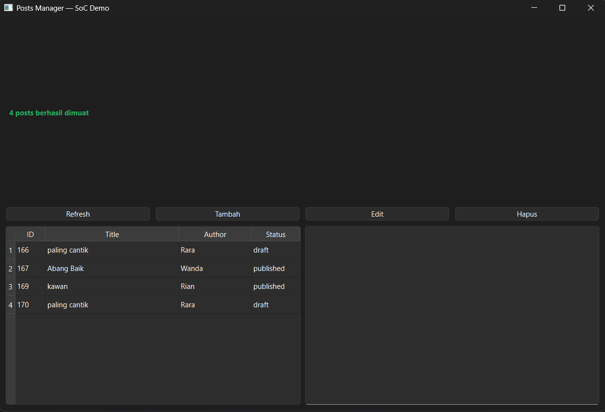

# Posts Manager — SoC Demo

Nama: Farid Nanda Syauqi
NIM: F1D02310050
Kelas: C

[](https://www.python.org/)
[](https://doc.qt.io/qtforpython/)
[](https://requests.readthedocs.io/)

## 📸 Antarmuka Aplikasi


---

Posts Manager adalah aplikasi desktop CRUD (Create, Read, Update, Delete) modern untuk manajemen artikel/blog postingan. Aplikasi ini dibangun menggunakan **PySide6** (Qt for Python) dengan penerapan arsitektur **Separation of Concerns (SoC)** secara ketat dan manajemen thread asinkronus agar antarmuka tidak membeku (*non-freezing UI*).

---

## 📌 Fitur Utama

* **Tampilkan Daftar Posts (Read):** Mengambil semua data postingan secara otomatis dari API jarak jauh dan merendernya ke dalam komponen `QTableWidget` dengan kolom: ID, Title, Author, dan Status.
* **Detail Post Komprehensif:** Panel peninjau samping (*side panel*) interaktif yang menampilkan konten lengkap artikel, metadata (Slug, Status, Tanggal dibuat), beserta daftar komentar terkait.
* **Tambah Post Baru (Create):** Mengirimkan data artikel baru (`title`, `body`, `author`, `slug`, `status`) melalui *custom dialog input* dan menampilkan ID unik yang di-generate oleh server backend.
* **Perbarui Post (Update):** Fitur edit data bawaan yang memuat data lama ke dalam form dialog untuk dimodifikasi sebelum dikirimkan kembali via metode `PUT` ke API.
* **Hapus Post Aman (Delete):** Penghapusan data berbasis dialog konfirmasi yang memicu aksi *cascade delete* di sisi backend (seluruh komentar yang terikat pada post otomatis ikut terhapus).
* **True Multithreading:** Semua proses pemanggilan jaringan (API calls) diisolasi di dalam `QThread` dan `QObject` terpisah menggunakan mekanisme *Qt Signals and Slots*.
* **State & Error Handling Robust:** Aplikasi mengunci tombol aksi dan menampilkan indikator *"Loading data..."* saat berinteraksi dengan jaringan, serta mampu menangkap pesan error detail (termasuk validasi gagal `422 Unprocessable Entity`) dari server.

---

## 🛠️ Desain Arsitektur (Separation of Concerns)

Proyek ini dibagi menjadi 4 layer modular demi kemudahan pengujian (*testability*) dan skalabilitas:

1. **`api_service.py` (Network Layer):** Murni berisi logika HTTP request menggunakan library `requests`. Bebas dari dependensi Qt sehingga bisa di-test langsung lewat terminal.
2. **`api_worker.py` (Concurrency Layer):** Menangani eksekusi asinkronus di background thread dan mengirimkan state data kembali ke UI lewat sinyal Qt (`success`, `error`, `finished`).
3. **`dialogs.py` (View Component):** Form input dinamis multi-mode yang melayani pembuatan data baru maupun pembaruan data lama.
4. **`main.py` (Orchestrator):** Pusat kendali aplikasi yang mengikat seluruh visualisasi UI, siklus memori thread (`deleteLater`), dan manajemen state aplikasi.

---

## 🚀 Cara Menjalankan Aplikasi

### 1. Setup Environment
Buka terminal di direktori proyek Anda, buat *virtual environment*, lalu aktifkan:

```bash
# Membuat venv
python -m venv venv

# Mengaktifkan venv (Windows CMD/PowerShell)
.\venv\Scripts\activate

# Mengaktifkan venv (Linux/macOS)
source venv/bin/activate